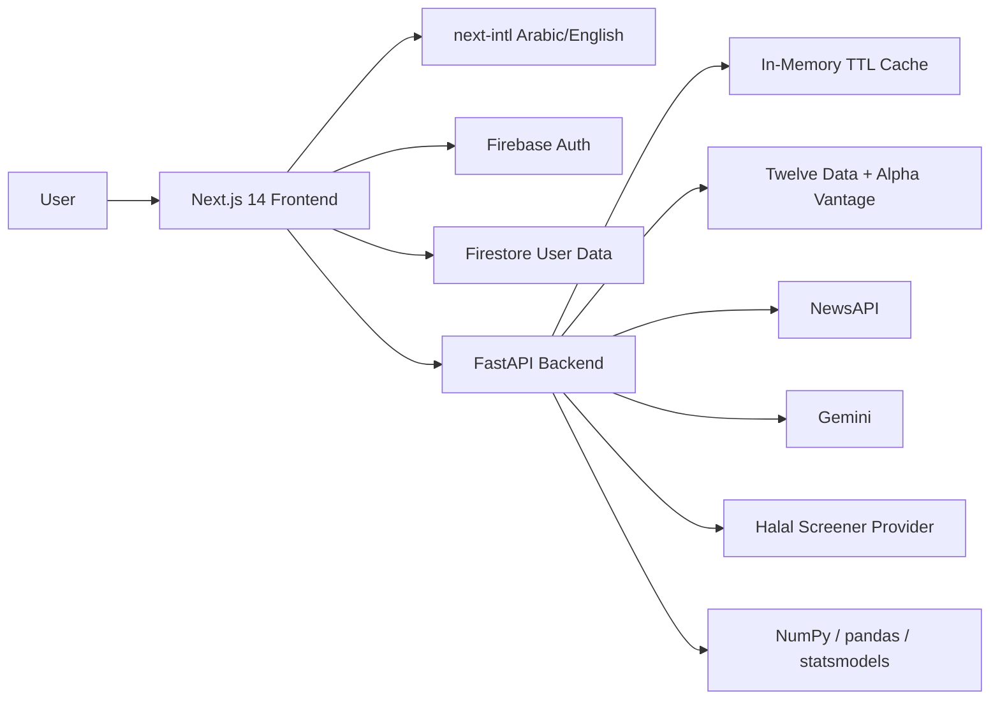

# $ahim (سهم)

> Arabic-first investment intelligence for beginner investors in the Arab world and Muslim users.

**SalamHack 2026 | Track 3: Understanding & Managing Money**

$ahim helps first-time investors understand stocks before making decisions. It starts by building a lightweight investor profile, then combines market data, mathematical risk analysis, AI news summaries, Shariah-compliance signals, and beginner-friendly tools into one bilingual web MVP.

---

## One-Minute Pitch

Beginner investors in the Arab world often start with scattered advice, English-first research, and uncertainty about risk or Shariah compliance. $ahim turns that journey into a guided, personalized experience:

1. The user creates a profile and chooses Arabic or English.
2. $ahim builds a beginner risk profile from simple questions about comfort level, horizon, and market knowledge.
3. The user searches for a stock or company.
4. $ahim returns a traffic-light Investment Readiness Score with the math behind it: volatility, VaR, Sharpe ratio, beta, and sentiment.
5. The stock is checked for Halal/Shariah status with clear disclaimers.
6. AI-generated Arabic news insights explain what happened, why it matters, and what risks or opportunities to watch.
7. The user's watchlist, risk profile, Zakat reminder, last viewed ticker, and alerts personalize the dashboard for future sessions.

The goal is not to tell users what to buy. The goal is to help Arabic-speaking beginners understand risk, compliance, and market context in a format that feels personal, trustworthy, and easy to act on.

---

## Personalized User Journey

$ahim is designed to start with the user, not the stock. The MVP builds a small profile from signals the user intentionally gives us, then uses that profile to personalize the dashboard and guide them toward the most relevant tools.

| Step | User Signal | How $ahim Uses It |
|---|---|---|
| Account creation | Name, email, locale, access tier | Creates a persistent profile and renders Arabic RTL or English LTR by default |
| Risk Wizard | Investment horizon, age range, knowledge level, income stability, drawdown tolerance, patience | Produces a conservative/moderate/aggressive profile and powers the dashboard risk card/gauge |
| Stock exploration | Last viewed ticker and searched companies | Defaults dashboard charts and quick actions to stocks the user already cares about |
| Watchlist | Saved tickers and Halal snapshot | Personalizes dashboard KPIs, portfolio visuals, news feed, and compliance monitoring |
| Zakat Calculator | Latest Zakat result metadata only | Shows a reminder state without storing raw portfolio value or liability inputs |
| Compliance alerts | Pro/Enterprise alert preferences per ticker | Lets users monitor Shariah status changes for stocks they follow |

In the hackathon MVP, this profile is intentionally lightweight and demo-safe. It does not store brokerage credentials, real transactions, KYC documents, payment methods, or raw Zakat inputs.

---

## Hackathon Fit

| SalamHack Track 3 Goal | How $ahim Addresses It |
|---|---|
| Help people understand and manage money | Converts stock data, risk, and news into beginner-readable explanations |
| Arabic-first financial literacy | Full Arabic/English UI with RTL support and plain-language Arabic summaries |
| Practical working prototype | Next.js frontend, FastAPI backend, Firebase Auth, Firestore, and live API endpoints |
| Innovation and impact | Combines quant finance, AI news analysis, Islamic finance, and SaaS personalization |
| Realistic MVP scope | Uses simple NoSQL persistence, in-memory TTL cache, and graceful API fallbacks |

---

## MVP Demo Flow

Use this path for the final hackathon presentation:

1. Open the landing page at `http://localhost:3000/ar`.
2. Click **Try It Now** and search for a stock/company in the landing search section.
3. Open a stock detail page such as `http://localhost:3000/ar/stock/AAPL`.
4. Show the traffic-light score, score components, Halal panel, AI news panel, ARIMA forecast, and sector comparison.
5. Sign in or create an account to show the soft sign-in gate and saved user state.
6. Open the Risk Wizard at `http://localhost:3000/ar/tools/risk-wizard` and complete a profile.
7. Save a ticker to the watchlist from a stock page.
8. Open the Zakat Calculator at `http://localhost:3000/ar/tools/zakat` and save the latest reminder metadata.
9. Open the dashboard at `http://localhost:3000/ar/dashboard`.
10. Show how the dashboard adapts around the user's watchlist, risk status, last viewed ticker, Zakat reminder, tier, service cards, news feed, and support chat.
11. Toggle a compliance alert on a saved ticker to show the Pro-tier storage boundary.

---

## What Is Implemented

| Area | MVP Capability |
|---|---|
| Landing + SaaS UX | Premium landing page, feature sections, pricing section, bilingual nav, CTA to stock search |
| Authentication | Firebase Auth-based sign-in/sign-up pages and auth presence handling |
| Soft sign-in gate | Guests see a teaser stock result, then a blocking sign-in modal to continue |
| User profile personalization | Firestore-backed profile, locale, tier, risk profile, watchlist, last viewed ticker, Zakat reminder, and alert preferences |
| Dashboard | Six-zone premium dashboard: ticker strip, KPI cards, ARIMA/portfolio visuals, service grid, sector/risk insights, news feed |
| Stock analysis | Stock detail page with Investment Readiness Score, risk panel, Halal panel, news panel, ARIMA chart, sector comparison |
| AI news | Gemini-backed Arabic news summarization and sentiment fallback behavior |
| Risk engine | Volatility, 95% VaR, Sharpe ratio, beta, low-confidence handling, and score components |
| Forecasting | ARIMA forecast service using `statsmodels` with confidence intervals |
| Islamic finance tools | Halal verdict display, purification calculator, Risk Wizard, Zakat Calculator, compliance alert preferences |
| Persistence | Firebase Auth + Firestore for user profile, watchlist, risk profile, Zakat metadata, and alert preferences |
| Service caching | FastAPI in-memory TTL cache for provider responses, kept separate from user-owned data |
| Internationalization | Arabic primary, English secondary, `next-intl`, RTL/LTR support |

---

## Product Features

### 1. User Profile & Personalization

$ahim creates a lightweight profile once the user signs in. That profile is used to tailor the product experience without collecting sensitive financial accounts.

Personalization inputs:

- Locale and layout direction
- Free/Pro/Enterprise tier
- Risk Wizard score and label
- Watchlist tickers
- Last viewed ticker
- Latest Zakat reminder metadata
- Compliance alert preferences

Personalized outputs:

- Dashboard risk card and risk gauge
- Watchlist count and Halal compliance KPI
- News feed based on saved tickers
- ARIMA default ticker from the user's last viewed stock
- Zakat reminder CTA or last-calculated state
- Tier-aware service cards and upgrade prompts
- Pro-only Shariah compliance alerts

### 2. Investment Readiness Score

The core score is a 0-100 beginner-readiness indicator:

| Band | Score | Meaning |
|---|---:|---|
| Green | 60-100 | Suitable / easier to understand |
| Yellow | 35-59 | Research more |
| Red | 0-34 | High caution |

Score weights currently implemented in `backend/app/services/score_engine.py`:

| Component | Weight |
|---|---:|
| Annualized volatility | 25% |
| 95% Value at Risk | 25% |
| Sharpe ratio | 20% |
| Beta | 15% |
| News sentiment | 15% |

### 3. Risk Analysis

The backend computes professional risk metrics and the frontend explains them in an accessible UI:

- Annualized volatility
- 95% VaR
- Sharpe ratio
- Beta
- RSI, MACD, moving averages, and fundamentals where provider data is available
- Low-confidence state for insufficient historical data

### 4. Halal / Shariah Screening

$ahim presents a Shariah status layer next to the stock analysis:

- `Halal`
- `PurificationRequired`
- `NonHalal`
- `Unknown`

The model supports provider-backed verdicts and ratio fields such as debt-to-market-cap and interest-income ratio. The Halal disclaimer is intentionally hardcoded in the backend model:

> التحقق النهائي من الحلية يقع على عاتق المستخدم

### 5. Arabic AI News Intelligence

The news agent fetches recent stock-related news and uses Gemini to produce:

- Sentiment: positive, neutral, or negative
- Arabic summary
- Key risks
- Key opportunities
- Graceful neutral fallback when the model or news source is unavailable

### 6. ARIMA Forecast

The ARIMA service produces a statistical projection with confidence intervals for supported tickers. It is presented as informational analysis only:

> هذا تقدير إحصائي مستقل، وليس نصيحة استثمارية مرخصة

### 7. Beginner + Islamic Finance Tools

| Tool | Purpose |
|---|---|
| Risk Wizard | Helps users discover whether they are conservative, moderate, or aggressive |
| Purification Calculator | Estimates how much non-compliant dividend income should be donated |
| Zakat Calculator | Estimates Zakat due using portfolio value, liabilities, currency, and nisab |
| Compliance Alerts | Stores ticker-level Shariah alert preferences for Pro/Enterprise users |

---

## Current App Routes

| Route | Description |
|---|---|
| `/{locale}` | Landing page, pricing, feature overview, stock search entry |
| `/{locale}/auth/signin` | Sign-in page |
| `/{locale}/auth/signup` | Sign-up page |
| `/{locale}/dashboard` | Authenticated dashboard |
| `/{locale}/stock/{ticker}` | Stock detail and analysis page |
| `/{locale}/tools/risk-wizard` | Risk profile wizard |
| `/{locale}/tools/zakat` | Zakat calculator |

Supported locales are `ar` and `en`.

---

## Architecture



| Layer | Technology |
|---|---|
| Frontend | Next.js 14, TypeScript, Tailwind CSS, Chart.js, Recharts, Framer Motion, lucide-react |
| Backend | Python 3.11+, FastAPI, uvicorn, pydantic-settings |
| Auth + MVP database | Firebase Auth + Firestore |
| Cache | Process-local FastAPI TTL cache via `cachetools` |
| Market data | Twelve Data primary, Alpha Vantage quote fallback |
| News + AI | NewsAPI + Gemini |
| Math/Forecasting | NumPy, pandas, scipy, statsmodels ARIMA |
| Deployment | Netlify frontend, Render backend |

---

## Firestore MVP Storage

Firestore is intentionally small and NoSQL-first for hackathon speed. User-owned data is stored under the authenticated user's own document tree only.

```text
users/{uid}
  email
  name
  photoURL
  locale
  tier
  onboarding
  investmentProfile
  watchlistCount
  halalComplianceRate
  riskProfile
  riskProfileLabel
  lastViewedTicker
  lastViewedAt
  lastZakatDate
  lastZakatResult

users/{uid}/watchlist/{ticker}
  ticker
  name
  exchange
  halalStatus
  addedAt
  updatedAt

users/{uid}/risk_profile/current
  user_id
  score
  label
  answers
  completed_at

users/{uid}/alert_preferences/{ticker}
  enabled
  last_known_status
  updated_at
```

### What We Store

- Profile metadata and locale
- Lightweight onboarding/investment preferences
- Free/Pro/Enterprise tier
- Watchlist tickers
- Dashboard KPI metadata
- Latest risk profile
- Latest Zakat reminder metadata
- Compliance alert preferences

### What We Do Not Store

- Brokerage credentials
- Real bank or trading transactions
- KYC/AML documents
- Payment methods
- Full portfolio imports
- Raw Zakat portfolio value or liabilities
- Persistent external market/news provider responses

Firestore rules live in `firestore.rules` and enforce owner-scoped access. New users default to `free`; Pro/Enterprise demo accounts are promoted manually through Firebase Console so the client cannot self-promote.

For the detailed storage map, see `docs/mvp-storage.md`.

---

## Backend Cache Boundaries

External provider responses are cached only as anonymous service data. Cache keys are based on subject and endpoint, never user identity.

| Endpoint Family | TTL |
|---|---|
| `search` | 1 hour |
| `news` | 1 hour |
| `gold-price` | 1 hour |
| `score` | Until daily UTC market rollover |
| `risk` | Until daily UTC market rollover |
| `halal` | 24 hours |
| `forecast` / `arima` | 24 hours |
| `sector` / `sectors` | 24 hours |

This keeps the demo fast without adding Redis, migrations, backend Firestore service accounts, or long-term market data storage.

---

## API Overview

| Method | Path | Description |
|---|---|---|
| `GET` | `/api/health` | Backend liveness probe |
| `GET` | `/api/search?q=` | Search stocks by ticker/company |
| `GET` | `/api/stock/{ticker}/score` | Investment Readiness Score |
| `GET` | `/api/stock/{ticker}/risk` | Risk metrics |
| `GET` | `/api/stock/{ticker}/halal` | Halal/Shariah verdict |
| `GET` | `/api/stock/{ticker}/news` | AI news analysis |
| `GET` | `/api/stock/{ticker}/forecast` | ARIMA forecast |
| `GET` | `/api/sectors` | Tracked sectors |
| `GET` | `/api/sectors/{ticker}` | Sector comparison |
| `POST` | `/api/allocate` | Budget allocation |
| `GET` | `/api/tools/gold-price` | Gold price for nisab/Zakat |
| `POST` | `/api/support/chat` | Website support assistant |

Interactive API docs are available at `http://localhost:8000/docs` when the backend is running.

---

## Local Development

Run backend and frontend in separate terminals.

### 1. Backend

```powershell
cd backend
python -m venv .venv
.venv\Scripts\Activate.ps1
pip install -e ".[dev]"
Copy-Item .env.example .env
python -m uvicorn app.main:app --reload --reload-dir app --port 8000
```

Backend URLs:

- Health check: `http://localhost:8000/api/health`
- Swagger docs: `http://localhost:8000/docs`

### 2. Frontend

```powershell
cd frontend
npm install
Copy-Item .env.local.example .env.local
npm run dev
```

Frontend URL:

- App: `http://localhost:3000`
- Arabic landing page: `http://localhost:3000/ar`
- English landing page: `http://localhost:3000/en`

### 3. Firebase Setup

1. Create a Firebase project.
2. Enable Firebase Authentication.
3. Enable Firestore in Native mode.
4. Copy Firebase Web App config into `frontend/.env.local`.
5. Deploy or paste `firestore.rules` in Firebase Console.
6. Promote demo users to Pro/Enterprise by editing `users/{uid}.tier` in Firebase Console.

Frontend Firebase values are browser-public config values, not service-account secrets.

---

## Environment Variables

### Backend `.env`

Use `backend/.env.example` as the source of truth.

| Variable | Purpose |
|---|---|
| `TWELVE_DATA_API_KEY` | Market search, quotes, OHLCV, technicals, fundamentals |
| `ALPHA_VANTAGE_API_KEY` | Quote fallback |
| `GEMINI_API_KEY` | AI news summaries and support assistant |
| `NEWSAPI_KEY` | News ingestion |
| `MUSAFFA_API_KEY` / halal provider key | Optional Shariah provider integration |
| `ALLOWED_ORIGINS` | Comma-separated frontend origins for CORS |

### Frontend `.env.local`

Use `frontend/.env.local.example`.

| Variable | Purpose |
|---|---|
| `NEXT_PUBLIC_API_URL` | FastAPI base URL, usually `http://127.0.0.1:8000` |
| `NEXT_PUBLIC_FIREBASE_API_KEY` | Firebase web app API key |
| `NEXT_PUBLIC_FIREBASE_AUTH_DOMAIN` | Firebase auth domain |
| `NEXT_PUBLIC_FIREBASE_PROJECT_ID` | Firebase project ID |
| `NEXT_PUBLIC_FIREBASE_APP_ID` | Firebase app ID |
| `NEXT_PUBLIC_AUTH_COOKIE_NAME` | Lightweight auth presence cookie name |

---

## Validation Commands

### Frontend

```powershell
cd frontend
npx tsc --noEmit --pretty false
npm run build
```

### Backend

```powershell
cd backend
.venv\Scripts\Activate.ps1
pytest tests/unit/ -v --cov=app --cov-report=term-missing
```

Useful backend quality commands:

```powershell
ruff check app/
ruff format app/
```

---

## Deployment

### Frontend: Netlify

The repo includes `netlify.toml`.

- Base directory: `frontend`
- Build command: `npm ci && npm run build`
- Publish directory: `.next`
- Required env: `NEXT_PUBLIC_API_URL` plus Firebase public config values

### Backend: Render

The repo includes `render.yaml`.

- Root directory: `backend`
- Build command: `pip install -e ".[dev]"`
- Start command: `uvicorn app.main:app --host 0.0.0.0 --port $PORT`
- Health check: `/api/health`
- Required env: backend API keys and `ALLOWED_ORIGINS`

---

## Business Model

$ahim is designed as a freemium SaaS:

| Tier | Intended Scope |
|---|---|
| Free | Landing page, stock search teaser/full basic score, basic Halal verdict, Risk Wizard, Zakat Calculator, dashboard access |
| Pro | Full ARIMA horizon, advanced risk panels, sector insights, larger news feed, portfolio allocator, compliance alerts |
| Enterprise | White-label risk/Halal intelligence for fintechs, brokerages, and Islamic finance platforms |

Billing is not implemented in the hackathon MVP. Pricing is represented as static product data and tier changes are handled manually for demo users.

---

## What Is Out of Scope

- Buying, selling, or executing trades
- Real bank account or brokerage integration
- KYC/AML collection
- Stripe checkout and subscription billing
- Email/push notifications
- Historical Zakat records
- Long-term storage of external market/news data
- Licensed investment advice

---

## Safety and Compliance Disclaimers

Arabic:

> تحليل معلوماتي مستقل، وليس نصيحة استثمارية مرخصة

> التحقق النهائي من الحلية يقع على عاتق المستخدم

> هذا تقدير إحصائي مستقل، وليس نصيحة استثمارية مرخصة

English:

> This platform provides educational and informational analysis only. It is not licensed investment advice.

> Final Shariah/Halal verification remains the user's responsibility.

---

## Repository Map

```text
backend/
  app/
    api/            FastAPI route modules
    models/         Pydantic response/request models
    services/       Market data, score, risk, news, halal, ARIMA, sector, support
    cache.py        In-memory TTL cache
    main.py         FastAPI app entry point
  tests/            Backend tests

frontend/
  src/
    app/            Next.js route pages
    components/     Landing, dashboard, stock, tools, and UI components
    hooks/          Dashboard, Firestore, tier, soft-gate, watchlist hooks
    lib/            API client, Firebase, Firestore, services, pricing, types
    messages/       Arabic and English translations

docs/
  mvp-storage.md    Firestore and cache design

specs/
  001-arabic-investment-intelligence/
  002-saas-frontend-refactor/
  003-halal-investor-tools/
  004-dashboard-refactor/
  005-firestore-mvp-storage/

originalReference/
  SalamHack.md
  Final_Presentation.md
  $ahim- project document COMBINED.md
```

---

## Source References

The README is synthesized from the implementation and these planning artifacts:

- [Core investment intelligence spec](specs/001-arabic-investment-intelligence/spec.md)
- [SaaS frontend refactor spec](specs/002-saas-frontend-refactor/spec.md)
- [Halal investor tools spec](specs/003-halal-investor-tools/spec.md)
- [Dashboard refactor spec](specs/004-dashboard-refactor/spec.md)
- [Firestore MVP storage spec](specs/005-firestore-mvp-storage/spec.md)
- [MVP storage design](docs/mvp-storage.md)
- [SalamHack reference](originalReference/SalamHack.md)
- [Final presentation checklist](originalReference/Final_Presentation.md)
- [Combined project document](<originalReference/$ahim- project document COMBINED.md>)
